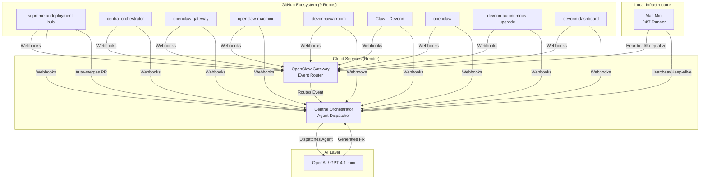

# Devonn Autonomous Ecosystem

> **A fully integrated, self-healing, AI-driven software development and deployment ecosystem.**

The Devonn Ecosystem consists of 9 interconnected repositories, 2 live cloud services, and a local Mac Mini runner. Together, they form an autonomous loop that ingests GitHub events, dispatches specialized AI agents (Security, Debug, Refactor, Performance), auto-generates fixes, and provides real-time observability.

---

## 🏗️ Architecture Overview



---

## 📦 Repository Map

| Repository | Role | Language | CI/CD |
|---|---|---|---|
| **[supreme-ai-deployment-hub](https://github.com/wesship/supreme-ai-deployment-hub)** | Main deployment hub and frontend | TypeScript | ✅ |
| **[central-orchestrator](https://github.com/wesship/central-orchestrator)** | Agent dispatcher and observability hub | Python | ✅ |
| **[openclaw-gateway](https://github.com/wesship/openclaw-gateway)** | Webhook receiver and event router | Python | ✅ |
| **[openclaw-macmini](https://github.com/wesship/openclaw-macmini)** | Local runner scripts and keep-alive system | Shell | ✅ |
| **[devonn-autonomous-upgrade](https://github.com/wesship/devonn-autonomous-upgrade)** | AI agent definitions and upgrade logic | Python | ✅ |
| **[devonn-dashboard](https://github.com/wesship/devonn-dashboard)** | Real-time ecosystem monitoring UI | Python | - |
| **[devonnaiwarroom](https://github.com/wesship/devonnaiwarroom)** | War room collaboration interface | TypeScript | - |
| **[Claw---Devonn](https://github.com/wesship/Claw---Devonn)** | Legacy/core Claw logic | Python | - |
| **[openclaw](https://github.com/wesship/openclaw)** | Core OpenClaw TypeScript implementation | TypeScript | - |

---

## 🤖 Autonomous Agents

The ecosystem features 4 specialized AI agents that are automatically dispatched based on GitHub webhook events:

1. **Security Agent** (Priority 1) — Triggered by `security_advisory`, `dependabot_alert`, `code_scanning_alert`
2. **Debug Agent** (Priority 2) — Triggered by `push`, `issues`, `check_run` (failure), `workflow_run` (failure)
3. **Performance Agent** (Priority 3) — Triggered by `release`
4. **Refactor Agent** (Priority 4) — Triggered by `pull_request`

---

## 🛡️ Hardening & Reliability

- **100% Webhook Coverage:** All 9 repos send events to both the Gateway and the Hub.
- **Automated Testing:** `pytest` with Codecov reporting runs on all Python services.
- **Security Scanning:** Trivy vulnerability scanning runs on every push.
- **Dependabot:** Automated dependency updates are enabled across the ecosystem.
- **24/7 Keep-Alive:** The Mac Mini runs a `caffeinate` + cron keep-alive system to prevent sleep and ensure local services are always available.
- **Heartbeat Monitoring:** A 30-minute cron job checks all services and repos, auto-opening GitHub issues if degradation is detected.

---

## 🚀 Getting Started

To spin up the core routing and orchestration layer locally:

```bash
# 1. Clone the Gateway
git clone https://github.com/wesship/openclaw-gateway
cd openclaw-gateway
pip install -r requirements.txt
export GH_TOKEN=your_token
export OPENAI_API_KEY=your_key
python gateway.py &

# 2. Clone the Orchestrator
cd ..
git clone https://github.com/wesship/central-orchestrator
cd central-orchestrator
pip install -r requirements.txt
cp .env.example .env
uvicorn hub:app --host 0.0.0.0 --port 8000
```
