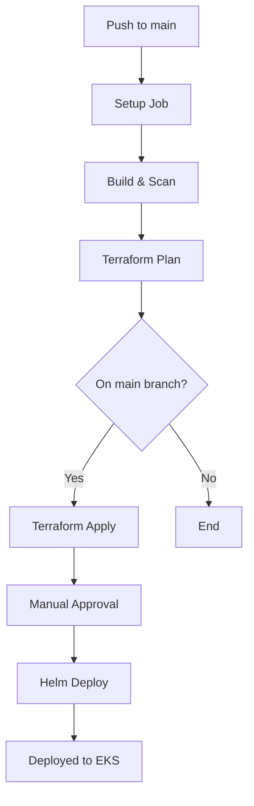

# Devonn.AI Studio - Deployment Setup Guide

Complete guide for setting up automated CI/CD deployment to AWS EKS with GitHub Actions.

## Prerequisites

- AWS Account with appropriate permissions
- GitHub account
- AWS CLI installed locally
- Terraform CLI installed locally
- kubectl installed locally

## Step 1: Bootstrap AWS Infrastructure

First, create the S3 bucket and DynamoDB table for Terraform state management.

```bash
cd infra/terraform/bootstrap
terraform init
terraform plan
terraform apply
```

**Save the outputs** - you'll need them for GitHub secrets:
- `terraform_state_bucket`
- `terraform_lock_table`
- `github_oidc_provider_arn`

## Step 2: Create IAM Role for GitHub Actions

### Option A: Using OIDC (Recommended)

1. Create the IAM role with the trust policy:

```bash
# Replace YOUR_AWS_ACCOUNT_ID, YOUR_GITHUB_USERNAME, YOUR_REPO_NAME
aws iam create-role \
  --role-name GitHubActionsRole \
  --assume-role-policy-document file://infra/iam/github-oidc-trust-policy.json
```

2. Attach the permissions policy:

```bash
aws iam put-role-policy \
  --role-name GitHubActionsRole \
  --policy-name GitHubActionsPolicy \
  --policy-document file://infra/iam/github-role-policy.json
```

3. Get the role ARN:

```bash
aws iam get-role --role-name GitHubActionsRole --query 'Role.Arn' --output text
```

### Option B: Using Static Credentials (Less Secure)

Create an IAM user with the same permissions policy and generate access keys.

## Step 3: Create ECR Repositories

```bash
export AWS_REGION=us-west-2

# Create backend repository
aws ecr create-repository \
  --repository-name devonn-backend \
  --region $AWS_REGION

# Create frontend repository
aws ecr create-repository \
  --repository-name devonn-frontend \
  --region $AWS_REGION
```

## Step 4: Configure GitHub Secrets

Go to your GitHub repository → Settings → Secrets and variables → Actions → New repository secret

Create the following secrets:

### Required Secrets

| Secret Name | Value | Description |
|------------|-------|-------------|
| `AWS_REGION` | `us-west-2` | Your AWS region |
| `AWS_ACCOUNT_ID` | `123456789012` | Your AWS account ID |
| `ECR_BACKEND_REPO` | `devonn-backend` | Backend ECR repository name |
| `ECR_FRONTEND_REPO` | `devonn-frontend` | Frontend ECR repository name |
| `TF_BUCKET` | Output from bootstrap | S3 bucket for Terraform state |
| `GITHUB_ROLE_ARN` | Output from IAM role creation | IAM role ARN (if using OIDC) |

### Optional Secrets (if using static credentials)

| Secret Name | Value |
|------------|-------|
| `AWS_ACCESS_KEY_ID` | Your AWS access key |
| `AWS_SECRET_ACCESS_KEY` | Your AWS secret key |

### Application Secrets (as needed)

| Secret Name | Description |
|------------|-------------|
| `TF_VAR_db_password` | Database password |
| `PINECONE_API_KEY` | Pinecone API key |
| `WEAVIATE_API_KEY` | Weaviate API key |
| `OPENAI_API_KEY` | OpenAI API key |

## Step 5: Initialize Git Repository

```bash
# Navigate to your project root
cd /path/to/devonn-ai-studio

# Initialize Git repository
git init
git checkout -b main

# Add all files
git add .
git commit -m "chore: initial commit - Devonn.AI Studio deployment"

# Create GitHub repository (using GitHub CLI)
gh repo create YOUR_USERNAME/devonn-ai-studio --public --source=. --remote=origin --push

# Or manually:
# 1. Create repo on github.com
# 2. Then run:
git remote add origin git@github.com:YOUR_USERNAME/YOUR_REPO.git
git push -u origin main
```

## Step 6: Configure GitHub Environment

1. Go to Settings → Environments → New environment
2. Create an environment named `production`
3. Add required reviewers for manual approval (optional)
4. Add environment secrets if needed

## Step 7: Verify Workflow

Push a change to trigger the workflow:

```bash
git add .
git commit -m "feat: trigger deployment pipeline"
git push origin main
```

Monitor the workflow:
1. Go to Actions tab in GitHub
2. Watch the CI/CD workflow execution
3. Approve the Terraform apply step when prompted
4. Verify Helm deployment completes

## Step 8: Access Your Deployment

After successful deployment, get the service URL:

```bash
kubectl get svc -n default devonn-studio-frontend -o jsonpath='{.status.loadBalancer.ingress[0].hostname}'
```

## Workflow Architecture



## Troubleshooting

### ECR Authentication Issues
```bash
aws ecr get-login-password --region $AWS_REGION | docker login --username AWS --password-stdin $AWS_ACCOUNT_ID.dkr.ecr.$AWS_REGION.amazonaws.com
```

### Terraform State Lock Issues
```bash
# Force unlock if needed (use with caution)
terraform force-unlock LOCK_ID
```

### EKS kubectl Access
```bash
aws eks update-kubeconfig --name YOUR_CLUSTER_NAME --region $AWS_REGION
kubectl get nodes
```

### View Helm Deployment Status
```bash
helm list -n default
helm status devonn-studio -n default
```

## Security Best Practices

1. ✅ Use OIDC instead of static credentials
2. ✅ Enable S3 bucket versioning for state files
3. ✅ Encrypt S3 buckets with AES256
4. ✅ Use DynamoDB for state locking
5. ✅ Run Trivy security scans on images
6. ✅ Store secrets in GitHub Secrets (encrypted)
7. ✅ Use least-privilege IAM policies
8. ✅ Enable manual approval for production deploys

## Next Steps

- Configure monitoring and logging
- Set up alerts for failed deployments
- Implement blue-green or canary deployments
- Add integration tests to pipeline
- Configure auto-scaling policies
- Set up backup and disaster recovery

## Additional Resources

- [GitHub Actions Documentation](https://docs.github.com/en/actions)
- [Terraform AWS Provider](https://registry.terraform.io/providers/hashicorp/aws/latest/docs)
- [Helm Charts Guide](https://helm.sh/docs/topics/charts/)
- [AWS EKS Best Practices](https://aws.github.io/aws-eks-best-practices/)
